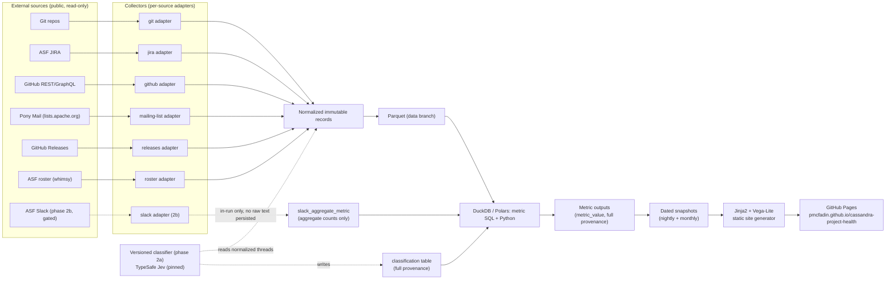

# Architecture

Deliverable #5. Binding inputs: `docs/research.md` (brief) and `docs/spec/DECISIONS.md` (D1–D9). Where this
document proposes something DECISIONS.md doesn't fix (e.g., which storage option under D3), it recommends one
option and says why. Facts about GitHub/Anthropic platform limits are marked **[verified]** with a source URL,
or **[unverified]** where I could not confirm them — treat unverified items as risks to close before build.

Companion documents referenced but not authored here: `METRICS.md` (metric formulas), `DATA-SOURCES.md`
(per-source access detail, rate limits, ToS), `COMMUNITY-HEALTH.md` (classification taxonomy, thread model,
validation methodology — written by another agent; this document only describes where the classifier sits in
the system), `SCORING.md` (dimension status logic). Sizing and reviewer-signal facts throughout this
document are drawn from a live probe against Cassandra's actual sources, `docs/spec/data-probe.md`
(2026-09-25, including its "Corrections" section), rather than re-derived here.

---

## 1. Pipeline overview



Two things run on different cadences (D5): **collection + full metric recompute** run nightly against the
live dashboard; **freezing a dated report** runs monthly and copies that night's computed outputs into an
immutable `/reports/YYYY-MM/` directory. The classifier (phase 2a) and Slack aggregation (phase 2b) are
additive stages that slot into the same pipeline once their gates (§6, ROADMAP.md) are cleared — they do not
change the collector → Parquet → DuckDB → site shape.

---

## 2. Project-agnostic core vs. project adapters

The core (collector interfaces, normalized schema, metric SQL, site generator, test harness) contains no
string literal referring to Cassandra, JIRA, or ASF. Everything project-specific lives in two places:

1. **`projects/<project_id>.yaml`** — declarative config (repos, tracker, lists, roster source, bot patterns,
   reviewer-extraction regex, baseline window).
2. **Adapter implementations** — Python classes satisfying `Protocol` interfaces in `core/adapters/`. Most
   projects need zero new adapter code, only config; a project needs new adapter code only when its source
   shape differs structurally (e.g., a project using GitHub Issues instead of JIRA needs the existing
   `github_issue_tracker` adapter selected in config, not a new class; a project with a wholly different
   issue tracker, e.g. Bugzilla, would need a new `IssueTrackerAdapter` implementation).

### 2.1 `projects/cassandra.yaml` (schema, annotated)

```yaml
project:
  id: cassandra
  display_name: Apache Cassandra
  homepage: https://cassandra.apache.org

repos:                      # one or more; git adapter clones/fetches each
  - owner: apache
    name: cassandra
    default_branch: trunk
  - owner: apache
    name: cassandra-website
    default_branch: main

issue_tracker:
  type: jira                # selects core/adapters/jira.py
  base_url: https://issues.apache.org/jira
  project_key: CASSANDRA

pull_requests:
  type: github               # selects core/adapters/github.py; GitHub PRs cover only
  repos: [apache/cassandra]  # part of review activity per DECISIONS.md — JIRA is primary for Cassandra

mailing_lists:
  type: ponymail              # selects core/adapters/ponymail.py
  domain: cassandra.apache.org
  lists: [dev, user, commits]
  metadata_only: true         # Phase 1 (D1): sender, timestamp, thread structure — no body

roster:
  type: asf_whimsy            # selects core/adapters/asf_roster.py
  committee_info_url: https://whimsy.apache.org/public/committee-info.json
  podling: false

releases:
  type: github_releases
  repos: [apache/cassandra]

affiliations_file: affiliations.yaml   # D6: curated, PR-reviewed, dated ranges

bot_patterns:                # applied by identity resolution before any metric counts a contributor
  - field: git_author_email
    regex: '(?i)noreply@github\.com$|\[bot\]'
  - field: github_login
    regex: '(?i)-bot$|^dependabot'
  - field: jira_username
    regex: '(?i)^svn-role$|^git-role$'   # ASF infra service accounts

reviewer_extraction:
  # Two independent sources, cross-checked against each other (see §3.1 note below):
  commit_trailer:
    type: commit_message_regex
    # Cassandra's commit convention: "patch by X; reviewed by Y for CASSANDRA-NNNNN"
    pattern: '(?i)patch\s+by\s+(?P<patch_by>.+?)\s*;\s*reviewed\s+by\s+(?P<reviewed_by>.+?)\s+for\s+(?P<issue_key>CASSANDRA-\d+)'
    exclude_merge_commits: true   # required — see §3.1
  jira_fields:
    type: jira_custom_field
    reviewers_field: customfield_12313420   # "Reviewers", multi-user
    reviewer_field: customfield_10022        # "Reviewer", single-user (older/legacy issues)
  reliable_from: "2017-01-01"    # coverage is patchier before this; see §3.1

baseline_window:
  trailing_months: 24        # D4: status vs. own trailing baseline; SCORING.md §4.1 — 24 completed months
  min_completed_months: 12   # below this, dimension status renders "insufficient data" (SCORING.md §5.1)

slack:                       # phase 2b only; absent/null until PMC + Infra gates clear (D1)
  enabled: false
  workspace: null
  channels: []
```

To add `apache/kafka` (Phase 3, D1/D9): write `projects/kafka.yaml` with `issue_tracker.project_key: KAFKA`,
`mailing_lists.domain: kafka.apache.org`, and a reviewer-extraction pattern matching Kafka's own commit
convention (Kafka does not use the same "patch by/reviewed by" trailer, so `reviewer_extraction.type` would
likely be `github_pr_review` instead of `commit_message_regex` — this is exactly the kind of difference the
config schema is designed to absorb without touching core code). No changes to `core/` should be required;
if the roadmap milestone for Kafka finds one, that is a bug in the "project-agnostic core" claim, not a
one-off exception (see ROADMAP.md Phase 3 exit criteria).

### 2.2 Adapter interfaces (Python Protocols, illustrative)

```python
from typing import Protocol, Iterator
from datetime import datetime

class Watermark(Protocol):
    source_id: str
    value: str          # opaque to core: a SHA, an updated-timestamp, a page cursor
    collected_at: datetime

class SourceCollector(Protocol):
    """One per source type. Registered by `type:` in projects/<id>.yaml."""
    source_id: str

    def collect(self, config: "ProjectConfig", watermark: Watermark | None) -> "CollectionResult": ...
    def next_watermark(self, result: "CollectionResult") -> Watermark: ...

class IssueTrackerAdapter(SourceCollector, Protocol):
    def fetch_issues(self, since: datetime | None) -> Iterator["NormalizedIssue"]: ...
    def fetch_comments(self, issue_key: str) -> Iterator["NormalizedComment"]: ...
    def fetch_changelog(self, issue_key: str) -> Iterator["NormalizedChangelogEntry"]: ...

class MailingListAdapter(SourceCollector, Protocol):
    def fetch_thread_metadata(self, list_name: str, month: str) -> Iterator["NormalizedMessageMeta"]: ...
    # Body fetch exists only for phase 2a classification, and its output is never written to the
    # data branch raw layer — see §6.
    def fetch_message_body(self, message_id: str) -> str: ...

class RosterAdapter(SourceCollector, Protocol):
    def fetch_roster(self) -> Iterator["NormalizedRosterEntry"]: ...

class ReviewerExtractor(Protocol):
    """Selected by reviewer_extraction.type; pure function, no I/O."""
    def extract(self, commit_message: str) -> "ReviewAttribution | None": ...
```

Core metric SQL and the site generator consume only the normalized tables (§3) and never call an adapter or
read `projects/*.yaml` directly — config only shapes *which adapters run and with what parameters*, not how
metrics are defined.

---

## 3. Normalized data model

All tables are **append-only / immutable at the row level**. A correction is a new row plus (where relevant)
an `superseded_by` pointer, never an in-place update — this is what makes the audit trail in §5 possible and
matches D2's "nothing changes silently."

| Table | Purpose | Key |
|---|---|---|
| `person_identity` | One row per resolved-or-provisional person | `identity_id` (surrogate UUID) |
| `identity_link` | Evidence linking one raw identifier to a `person_identity` | `link_id`; FK `identity_id` |
| `contribution_event` | Commits, PR opens/merges, issue opens/resolves | `event_id`; FK `identity_id` (nullable) |
| `review_event` | Patch-review and GitHub-review attributions | `event_id`; FK reviewer + author `identity_id` |
| `issue` | JIRA (or other tracker) issues | `issue_key` (natural) |
| `issue_comment` | Issue comments | `comment_id`; FK `issue_key` |
| `issue_changelog_entry` | Field transitions (status, assignee, fixVersion, …) | `id`; FK `issue_key` |
| `pr` | GitHub pull requests | `(repo, number)` (natural) |
| `pr_review` | GitHub PR reviews | `review_id`; FK `pr` |
| `pr_comment` | GitHub PR comments | `comment_id`; FK `pr` |
| `message_thread` | Mailing-list thread roll-up | `thread_id` |
| `message` | Mailing-list message metadata | `message_id`; FK `thread_id` |
| `release` | Tagged/published releases | `(repo, tag)` (natural) |
| `roster_entry` | Committer/PMC membership | FK `identity_id`; `(project, role, effective_from)` |
| `affiliation_period` | Org affiliation, dated range (D6) | FK `identity_id`; `(organization, effective_from)` |
| `source_snapshot` | One row per collector run per source | `snapshot_id`; FK `run_id` |
| `run_manifest` | One row per nightly/monthly/backfill run | `run_id` |
| `metric_definition_version` | Registry of metric formula versions | `(metric_id, version)` |
| `metric_value` | Computed metric, one row per (metric, version, window) | `id`; FK `run_id`, `metric_id`, `definition_version` |
| `classification` (phase 2a) | Classifier output, one row per message (schema per `COMMUNITY-HEALTH.md` §4.3) | `record_id`; FK `message_id`, `thread_id` |
| `slack_aggregate_metric` (phase 2b) | Aggregate-only Slack counts | `(metric_id, window, channel_bucket)` — no message-level rows exist |

Every fact table (`contribution_event`, `review_event`, `issue*`, `pr*`, `message*`, `release`,
`roster_entry`) carries a `source_snapshot_id` FK, which is how a metric traces back to exactly which
collector run produced the row it used (§5).

### 3.1 Reviewer data: two independent, cross-checkable sources — and a merge-commit trap

A data probe against live Cassandra sources (`docs/spec/data-probe.md`, 2026-09-25) found two independent
reviewer signals, both worth collecting into `review_event`:

- **Commit-trailer convention** (`patch by X; reviewed by Y for CASSANDRA-NNNNN`). A naive scan across all
  33,429 commits on `apache/cassandra` matches only 35.9% — but that figure is an artifact of merge commits:
  Cassandra merges each fix forward across release branches, and merge commits carry no trailer. **Merge
  commits must be excluded from both contribution and reviewer counts** (`git log --no-merges`); once
  excluded, the trailer is near-universal in recent history — 80–87% of non-merge commits from 2018 onward,
  climbing from ~45–57% in 2009–2013 to ~77%+ from 2017 onward. `reviewer_extraction.commit_trailer` above
  sets `exclude_merge_commits: true` for exactly this reason, and `reliable_from: "2017-01-01"` marks where
  coverage becomes dense enough to trust as a baseline start for reviewer-concentration metrics (pre-2017
  data can still be collected and shown, just flagged lower-confidence or excluded from baseline
  computation — see `SCORING.md`/`baseline_window`).
- **JIRA reviewer custom fields**: `customfield_12313420` ("Reviewers", multi-user, populated on 11,125
  `CASSANDRA` issues) and `customfield_10022` ("Reviewer", single-user, populated on 7,104 issues, an older/
  legacy field). These are collected by the JIRA adapter alongside the standard fields and normalized into
  `review_event` with `source = 'jira_field'`.

Both sources populate the same `review_event` table (`source` column distinguishes `commit_trailer` vs.
`jira_field`), which lets a reviewer-concentration metric either combine them or compute both independently
and flag large divergences as a data-quality signal — useful given the two sources aren't guaranteed to
agree (a commit trailer can list reviewers never entered into the JIRA field, and vice versa).

Column detail for the identity tables, since the unresolved-identity rule is the most load-bearing part of
this model:

```
person_identity(
    identity_id UUID PRIMARY KEY,
    display_name TEXT,
    status ENUM('resolved','provisional') NOT NULL,
    created_at TIMESTAMP
)

identity_link(
    link_id UUID PRIMARY KEY,
    identity_id UUID REFERENCES person_identity,
    source_type ENUM('git_email','github_login','jira_username','mailing_list_address'),
    source_value TEXT,
    confidence ENUM('exact','high','medium','low') NOT NULL,
    evidence TEXT,              -- human-readable: what heuristic/rule produced this link, and why
    linked_by TEXT,              -- heuristic name+version, or 'manual:<github-username-of-reviewer>'
    linked_at TIMESTAMP
)
```

**Unresolved-identity rule (binding, per D2 rule 5 / research.md "Identity Resolution"):**

- A new raw identifier (email, login, JIRA username, list address) is matched against existing
  `person_identity` rows only through explicit, evidenced heuristics (exact email match, verified
  GitHub-noreply-email → login mapping, etc.), each stamped with a `confidence` level.
- Links at `confidence = exact` or `high` may be created automatically by the pipeline.
- Links at `confidence = medium` or `low` **never** auto-attach to an existing `person_identity`. The
  pipeline instead creates a new `person_identity` with `status = provisional` and records the low-confidence
  link separately for human review.
- Two identities are never silently merged after creation. Merging an existing provisional identity into
  another requires a human-authored, PR-reviewed entry in an `identity_overrides.yaml` file (same review
  discipline as `affiliations.yaml`, D6) — this produces a new `identity_link` row with
  `linked_by = 'manual:<reviewer>'` and full evidence text, never an UPDATE/DELETE of prior rows.
- Metrics that count "contributors" always resolve through `identity_link`, so a person counted twice under
  two provisional identities under-counts unique contributors rather than over-counting — the system is
  deliberately biased toward undercount over false-merge, matching D2.

---

## 4. Storage decision (D3)

D3 mandates a hybrid: raw source data cached incrementally as Parquet, off `main`, with the architecture doc
recommending one concrete mechanism with size estimates.

### 4.1 Options evaluated

| Option | Verified constraints | Fit |
|---|---|---|
| **Orphan `data` branch** | Git repo on-disk size: GitHub's own guidance is a recommended max object size of 1 MB, hard-blocked at 100 MB per file; recommended repo (`.git`) size ceiling ~10 GB **[verified]** ([GitHub Docs: Repository limits](https://docs.github.com/en/repositories/creating-and-managing-repositories/repository-limits)) | Natural fit: each collector run is a commit, giving free point-in-time history, diffability, and zero external dependency. Parquet files must stay well under 100 MB each (partition by source + month if needed). |
| **GitHub Release assets** | Each asset file must be under 2 GiB; up to 1,000 assets per release; no published cap on total release size **[verified]** ([GitHub Docs: About releases](https://docs.github.com/en/repositories/releasing-projects-on-github/about-releases)) | Generous per-file ceiling, but releases are not designed for incremental append — updating one table nightly means either re-uploading a full replacement asset every run (wasteful, and loses natural diff/history) or creating a new dated release nightly (workable but clumsy to query "give me the latest snapshot of table X" without also tracking release-to-table mapping externally). |
| **Actions cache** | Default 10 GB total per repo (can now exceed via pay-as-you-go as of Nov 2025); entries evicted after 7 days unused, and oldest-first once over cap **[verified]** ([GitHub Blog: cache size 10GB](https://github.blog/changelog/2021-11-22-github-actions-cache-size-is-now-increased-to-10gb-per-repository/), [Nov 2025 change](https://github.blog/changelog/2025-11-20-github-actions-cache-size-can-now-exceed-10-gb-per-repository/)) | Disqualified as the durable store: cache is explicitly a best-effort, evictable, CI-scoped mechanism, not a historical record. Fine as a *build accelerator* (e.g., caching a git clone between jobs) but not for D3's "raw source data cached... stored off main." |
| **External bucket (S3/R2/GCS)** | No GitHub-imposed size limit; requires an external account, credentials as a repo secret, and (usually) a bill | Most scalable, but adds a non-GitHub, non-public-by-default dependency to a project whose stated design bias (D8, D9) is "static artifacts... unless research demonstrates they are necessary," and moves the historical raw data out of the fully public, freely cloneable, zero-account-needed GitHub repo — worse for a from-any-fork-reproducible, personal-account OSS project. |

### 4.2 Recommendation: orphan `data` branch, with a Release-asset cold-storage escape hatch

**Recommend the orphan `data` branch as primary storage**, structured as:

```
data branch root
├── raw/<source>/<table>/date=YYYY-MM-DD/part-*.parquet   # append-only, one partition per collection run
├── snapshots/<run_id>/metrics.parquet                     # full computed-metric output for that run
└── manifests/<run_id>.json                                 # run manifest (§5)
```

**Size estimate for Cassandra**, using the live data probe against actual sources (`docs/spec/data-probe.md`,
2026-09-25) rather than the brief's rough figures — all confirmed **[verified]**:

- Commits: **33,429 total commits** on `apache/cassandra` (all branches), 743 unique author emails, history
  from 2009-03-02, 338 tags. One row per commit in `contribution_event` (narrow columns, Parquet-compressed)
  — a few MB.
- JIRA: **21,483 total issues** in `CASSANDRA`, running at ~900 new issues/year in recent years (885–1,105
  from 2022–2025). Plus comments/changelog entries per issue and two reviewer custom fields
  (`customfield_12313420` populated on 11,125 issues, `customfield_10022` on 7,104) — still comfortably tens
  to low hundreds of MB as columnar Parquet even generously assuming ~15 comment+changelog rows/issue.
- GitHub: **5,207 pull requests** on `apache/cassandra` (issues/discussions are disabled on that repo, so
  no GitHub-native issue data exists there — JIRA is the sole issue-of-record, confirming DECISIONS.md's
  "Cassandra-specific facts"). PR + review + comment rows: low tens of MB.
- Mailing lists: dev@cassandra.apache.org alone runs **1,200–3,000 messages/year** in recent years (2017–
  2026), consistent across the full 2009–2026 archive window; user@ and commits@ add more but are the same
  order of magnitude. **Metadata only in Phase 1** (sender, timestamp, thread structure — no body, per D1),
  so total volume across ~17 years of all three lists is comfortably under 100 MB even at generous per-
  message row overhead.
- Roster: 49 PMC members, 101 total committers/PMC — trivial size, re-fetched in full each run (§4.3).
- Phase 2a does **not** add a body-storage requirement: classifier input-hash caching (§6) only needs to
  persist a hash and the classification result, not the raw message/comment text, so mailing-list and
  JIRA-comment bodies are fetched transiently at classification time and never committed to the `data`
  branch raw layer.

**Net projection: comfortably under 500 MB through Phase 1 and full Phase 2a maturity** — well under an
order of magnitude under GitHub's ~10 GB repo-size guidance, and individual Parquet part-files (partitioned
by source/table/date) stay far under the 100 MB per-file block if partitioned reasonably (monthly or
per-run partitions, not one giant file). This is comfortable enough that Phase 3 (adding Kafka, a project of
broadly comparable scale) does not change the recommendation.

**Escape hatch:** if actual growth outpaces this projection (e.g., a design change starts persisting raw
message bodies, or Slack volume turns out to be large before phase 2b's "never persist" rule is enforced in
code), migrate older partitions (`raw/<source>/<table>/date=<old>/*.parquet`) to GitHub Release assets as
cold storage, keeping only the current + trailing-N-months hot partitions in the `data` branch. This is a
mechanical migration (Release assets and branch partitions share the same partition-file naming), not an
architecture change, and is deferred until size data justifies it rather than pre-built speculatively.

### 4.3 Incremental watermark strategy per source

| Source | Watermark | Notes |
|---|---|---|
| git | Last collected commit SHA per repo/branch | New commits appended; full history walked once on first run per repo |
| JIRA | `max(issue.updated)` seen, used in `updated >= watermark` JQL | Comments/changelog re-pulled in full for any issue whose `updated` moved, since old issues can get new comments |
| GitHub PRs/issues | `max(updatedAt)` via GraphQL cursor | Same "re-pull touched records fully" logic as JIRA |
| Mailing lists (Pony Mail) | Per-list last message epoch fetched via `stats.lua` | Current month is always re-fetched in full each run (in-flight threads); completed months are immutable and fetched once |
| Releases | `max(published_at)` seen via GitHub Releases API | Small enough to just re-list on every run |
| ASF roster | None — the source file itself is small | Full `committee-info.json` re-fetched every run; the collector diffs against the prior snapshot to open/close `roster_entry`/`affiliation_period` ranges |

**Metrics are never computed incrementally.** Per D3, every run recomputes every metric from the *entire*
accumulated raw Parquet cache, stamped with the metric's `definition_version`. This is deliberate: it means
late-arriving data (a backdated JIRA comment, a re-opened issue) and metric-definition changes both produce
a complete, internally consistent history rather than a patchwork of old-formula and new-formula values.

### 4.4 Version stamping and recompute-on-bump

- `metric_definition_version(metric_id, version, description, changed_at, changelog_note)` is the registry.
  `version` is semver-ish (`1.0`, `1.1`, `2.0`).
- Every `metric_value` row is stamped with the `definition_version` that produced it. Rows are **never
  overwritten** — a definition bump adds new rows under the new version; old-version rows remain queryable
  (linked from each metric's version-history section, §7).
- When a metric's definition version bumps, the next run (nightly or an explicit `workflow_dispatch`
  backfill) recomputes that metric across the *entire* historical window under the new version — a visible,
  full-history recompute, not a forward-only change — and writes one `changelog.md` entry (source-controlled
  on `main`, surfaced on the site's Changelog page) describing what changed and why. This satisfies D2 rule 6
  ("nothing changes silently") and D3's "explicitly, never mixing versions silently."

---

## 5. Provenance model

Every published metric value must resolve, from the chart, to:

```
metric_value {
  metric_id
  definition_version
  dimension
  window_start, window_end
  value
  tier                    # established | proxy | experimental | classified  (D2 rule 1)
  population_count
  exclusions              # e.g. {"bots_excluded": 42, "unresolved_identities_excluded": 7}
  run_id                  -> run_manifest
  source_snapshot_ids     -> [source_snapshot...]   # one per source the metric drew from
  pipeline_code_sha       # git SHA of the pipeline repo (main) at computation time
  computed_at
}
```

- **`source_snapshot_ids`** point at rows in `source_snapshot`, each of which records `source`,
  `collected_at`, `watermark_value`, and `record_count` — so "what raw data, as of when" is answerable per
  source, not just per run.
- **`pipeline_code_sha`** is the `main`-branch commit SHA checked out by the workflow run that produced the
  value — ties a number back to the exact metric-calculation code, independent of `definition_version` (a
  bug fix that doesn't change the formula's meaning bumps the SHA but not necessarily the version; a formula
  change bumps both).
- **Per-chart download**: every chart on the site ships a sibling `<metric_id>.json` and `<metric_id>.csv`
  containing exactly the rows backing that chart, with the `metric_value` provenance block above as a header
  (JSON) or leading comment block (CSV) — D8's "every chart's data is published as a downloadable JSON/CSV
  beside it."
- **Run manifest** (`run_manifest`, one per nightly/monthly/backfill run):

```json
{
  "run_id": "2026-09-25-a1b2c3d",
  "trigger": "schedule | workflow_dispatch:backfill | workflow_dispatch:monthly-edition",
  "started_at": "...", "completed_at": "...",
  "pipeline_code_sha": "a1b2c3d...",
  "sources": {
    "git": {"status": "ok", "watermark": "sha:...", "records_collected": 42},
    "jira": {"status": "ok", "watermark": "2026-09-25T04:00:00Z", "records_collected": 118},
    "ponymail": {"status": "stale", "reason": "3 retries exhausted: 503", "last_good_snapshot": "2026-09-24-..."}
  },
  "metrics_computed": ["active_contributors@1.0", "reviewer_hhi@1.0", "..."],
  "metrics_skipped_insufficient_data": [],
  "data_branch_commit": "d4e5f6...",
  "site_deploy_status": "ok"
}
```

This manifest is itself committed to the `data` branch (`manifests/<run_id>.json`) and is the object every
`metric_value.run_id` and `source_snapshot.run_id` foreign-keys to.

---

## 6. Classifier architecture (phase 2, system level)

Taxonomy detail (the specific categories, thread-trajectory model, and validation methodology) is
`COMMUNITY-HEALTH.md`'s job; this section is only the system-level plumbing the classifier plugs into.

Provider note (D17): this section originally described an Anthropic-based implementation. The project owner
decided (2026-09-25) to build Phase 2a classification on TypeSafe's Jev System One model instead, via the
`typesafe-sdk` Python package. The provider-agnostic interface below is unchanged by that decision — only the
implementation behind it is — which is the point of specifying it as an interface in the first place.

- **Provider-agnostic interface**: `Classifier` Protocol —
  `classify(thread: NormalizedThread, schema_version: str) -> list[ClassificationResult]`. The pipeline calls
  this interface, not a vendor SDK directly, so the classifier backend can change without touching metric
  code.
- **TypeSafe Jev implementation** (phase 2a default, per D17): the pipeline calls TypeSafe's `system_one` API
  through the `typesafe-sdk` Python package, one call per message. State is the small named-field object
  `COMMUNITY-HEALTH.md` §4.1/§4.4 requires — `message.text`, `parent.text` (nullable), `message.source` — built
  by the normalization step above, never the full thread and never author identity. Questions are the
  versioned set in `src/project_health/classify/questions_v1.yaml` (COMMUNITY-HEALTH.md §4.2/§4.4, issue #42):
  one Noul per message-level label (§1.2) plus one descriptive `tone_intensity` Score, all thirteen asked
  together in a single `system_one` call per message — TypeSafe's documented model runs independent questions
  over one state in parallel with no visibility into each other's answers
  (`concepts/how-to-build-with-system-one`), which is also why this design costs one call per message, not
  thirteen.
- **No provider batch-job API (unlike the prior Anthropic-based design)**: TypeSafe's documented interface
  (`api.md`, `sdk/python.md`) is a synchronous request over one state; there is no documented message-batching
  endpoint as of this writing, unlike the Anthropic Message Batches API this section previously specified. The
  nightly/backfill run instead achieves throughput with many concurrent `system_one` calls via the SDK's async
  client (`AsyncTypeSafeClient`), bounded by a concurrency limit and the same retry/backoff policy as the
  other collectors (§7.2). This is a cost/throughput optimization, not a correctness requirement, so it should
  be revisited if TypeSafe later documents a batch endpoint.
- **Pinned model, response-reported model recorded**: requests pin `model: jev-1.13.0` (never a `-latest`
  alias, D17); the `model` field the response actually reports is what gets stored as `model_id` on every
  classification record, so a provider-side model change is auditable even though the request asked for a
  fixed version.
- **Input-hash caching, unchanged in spirit**: `input_hash = sha256(normalized_message_text +
  normalized_parent_text + question_set_version + model_id)`. Before submitting a message for classification,
  the pipeline checks `classification` for an existing row with the same `input_hash`; if found, it's skipped
  (not resubmitted, not rebilled). This is why the raw message text itself does not need to be persisted
  anywhere durable beyond the normal off-`main` cache — only the hash needs to be reproducible from the
  source on demand, and Pony Mail / JIRA / GitHub are themselves the durable, public, re-fetchable archive.
- **Classification storage with full provenance**: one row per message, in the exact shape
  `COMMUNITY-HEALTH.md` §4.3 defines — `classification(record_id, message_id, thread_id, source,
  classifier_version, question_set_version, model_id, input_hash, classified_at, labels, tone_intensity,
  usage, human_reviewed, human_label_id, superseded_by)`, where `labels` is the per-label `{probability}`
  object from that schema — a raw Noul value, not a `{present, confidence}` pair, since D17 moves thresholding
  into code per label (re-thresholding after calibration against the benchmark, issue #47, never requires
  re-inference) — `tone_intensity` is the `{score, confidence, probabilities}` Score output (descriptive only,
  never a gate input per §5.1's no-composite-score rule), and `usage` is the `{input_tokens, output_tokens}`
  object from the response, tracked against D10's monthly cost cap. This document defers to
  `COMMUNITY-HEALTH.md` as the schema's source of truth rather than restating a divergent one.
  `classifier_version` is a version the project controls (question-set/schema/post-processing changes bump
  it, same recompute-on-bump discipline as metric definitions, D2 rule 6); `question_set_version` tracks
  `questions_v1.yaml` specifically; `model_id` is the pinned-and-response-confirmed provider model
  identifier, recorded for auditability but not itself the versioning axis.
- **Large-irrelevant-context mitigation is architectural, not just a prompting choice.** TypeSafe documents
  that "unrelated detail acts as a distractor" for Jev and that a large state makes it harder to isolate which
  part of the input produced a wrong answer (`model-jaggedness/jev-1.13`). This is why classifier state is
  built from exactly `message.text`/`parent.text`/`message.source` — `COMMUNITY-HEALTH.md` §4.1's existing
  "one message plus immediate parent, never the full thread" rule already matches this — and why author
  identity/role/history is excluded at the normalization step, before the classifier ever runs. The exclusion
  `COMMUNITY-HEALTH.md` §4.1 already required for bias-avoidance reasons turns out to double as jaggedness
  mitigation under the new provider.
- **Slack path (phase 2b) never persists raw text**, per D1: the Slack collector reads public-channel
  messages in-run, passes them directly to the classifier in-process, and writes only
  `slack_aggregate_metric(metric_id, window, channel_bucket, count)` rows — there is no
  `slack_message` table, no per-message classification row, and no code path that writes Slack message text
  or links to the `data` branch or `main`. This is enforced architecturally (the Slack adapter has no Parquet
  writer for raw content, only an aggregator), not just by convention, and aggregate rows below a minimum
  sample-size threshold render as "insufficient data" rather than publishing a low-N count (D2 rule 5,
  research.md ethics section).

---

## 7. Execution model (GitHub Actions)

### 7.1 Workflows

| Workflow | Trigger | Purpose |
|---|---|---|
| `nightly.yml` | `schedule: cron: '17 6 * * *'` (an off-the-hour minute, to reduce the documented delay risk at `:00`/`:30` — GitHub's docs say the schedule event "can be delayed during periods of high loads... high load times include the start of every hour" **[verified]**, [GitHub Docs: events that trigger workflows](https://docs.github.com/en/actions/writing-workflows/choosing-when-your-workflow-runs/events-that-trigger-workflows)) | Incremental collection per source (§4.3) → full metric recompute → regenerate dashboard → deploy to Pages |
| `monthly-edition.yml` | `schedule: cron: '0 7 1 * *'` | After that night's nightly run completes, copies the computed outputs into an immutable `/reports/YYYY-MM/` (D5); only counts completed months |
| `backfill.yml` | `workflow_dispatch` (inputs: `source`, `since`, `force_full`, `metric_version`) | Manual recompute/backfill — e.g., after a metric-definition bump, or to re-collect a source that was stale for several nights |
| `pr-checks.yml` | `pull_request` | Lint, unit tests, golden metric tests, schema validation — no deploy, no writes to `data` |

**GitHub's documented risk to plan around**: in a *public* repository, scheduled workflows are automatically
disabled after 60 days with no repository activity **[verified]**, same source as above. GitHub does not
define what counts as "activity" for this purpose, so this project does not rely on any single activity type
continuing to count — it builds in three independent mitigations instead of assuming one will always work:

1. **A `main`-branch heartbeat.** `monthly-edition.yml` commits the frozen report manifest (`/reports/YYYY-MM/`,
   §7.1) to `main` once a month — an explicit, unambiguous repository-activity event on `main` itself, not just
   on the orphan `data` branch, so the project doesn't depend on `data`-branch commits alone counting toward
   GitHub's undocumented activity definition.
2. **A visible data-freshness/staleness banner**, distinct from the per-source staleness badge in §7.3: the
   site reads `run_manifest.completed_at` (§5) for the most recent successful run and renders a banner if that
   date is further in the past than expected for the nightly cadence — this is the user-facing signal that
   `schedule` may have stopped firing (for this reason or any other), not just that one source went stale.
3. **A documented manual re-enable step.** If `nightly.yml` itself fails silently for 60+ days and `schedule`
   stops firing, `workflow_dispatch` (already wired for `backfill.yml` and available on any workflow) is the
   re-enable path — documented in `/methodology/` and in the repo's own operational runbook, not left as
   implicit GitHub Actions knowledge, so the project owner (or anyone helping maintain it) has a written step
   to follow rather than needing to rediscover it.

The monthly-report freeze (mitigation 1) also serves as a second heartbeat that keeps repo activity current
independent of the `data` branch.

### 7.2 Concurrency, timeouts, retries

- All four workflows that can write to the `data` branch (`nightly`, `monthly-edition`, `backfill`) share one
  concurrency group, e.g. `concurrency: { group: data-branch-writer, cancel-in-progress: false }` — this
  serializes writes so two runs never race on the same branch; a run queues behind an in-progress one rather
  than cancelling it (cancelling mid-write risks a half-committed Parquet partition).
- Per-job `timeout-minutes` set well under the platform's 6-hour hard job limit **[verified]** ([GitHub Docs:
  Actions limits](https://docs.github.com/en/actions/reference/actions-limits)) — e.g., 30–60 minutes per
  collector job, so a hung API call fails fast rather than consuming the full budget. The 35-day
  workflow-run limit is not a practical constraint at these job lengths but is noted for completeness
  (source: same page).
- Transient failures (rate limits, 5xx from JIRA/GitHub/Pony Mail) retry with exponential backoff and jitter,
  capped at 3–5 attempts, at the collector-call level (not the whole-job level) so one flaky HTTP call
  doesn't force re-collecting an entire source from scratch.

### 7.3 Partial-failure behavior — a failed source never publishes stale-as-fresh

- Each collector's outcome (`ok` / `stale` / `failed`) is recorded per source in the run manifest (§5).
- If a source's collection fails after retries are exhausted, the pipeline **reuses that source's last known
  good snapshot** for metric computation (so one flaky source doesn't halt the whole nightly run), but the
  site renders an explicit staleness badge on every card/metric that depends on that source
  ("JIRA data last refreshed 2026-09-23 — collection failed on 2026-09-24, 2026-09-25"), sourced directly
  from `run_manifest.sources.<source>.status` and `last_good_snapshot`. This is the concrete mechanism behind
  D3/D2's "a failed source doesn't publish stale-as-fresh."
- If metric *computation* itself fails (a bug, not a source outage), the deploy step is gated on that job's
  success and the site is **not** redeployed — the previous good Pages deployment stays live rather than
  shipping a broken or half-computed dashboard.

### 7.4 Secrets

| Secret | Phase | Scope |
|---|---|---|
| `GITHUB_TOKEN` (built-in) | 1 | `contents: write` (data branch + reports), `pages: write`, `id-token: write` (OIDC for Pages deploy) |
| `GH_PAT` (classic PAT) | 1 | Repo secret; recommended, not strictly required (`DATA-SOURCES.md` §13) — public read-only scope (`public_repo` or equivalent); gives the full 5,000 req/hr shared budget across all `apache/*` repos in one run instead of the built-in token's 1,000 req/hr/repo bucket |
| `TYPESAFE_API_KEY` | 2a | Repo secret; used only by the classifier step (D17). Locally read from the gitignored `.env`. |
| Slack bot token | 2b | Repo/org secret; read-only scope on the specific public channels approved by ASF Infra (D1) |

### 7.5 Pages deployment

Deploy via `actions/upload-pages-artifact` + `actions/deploy-pages`, GitHub's supported pattern: the upload
action packages the generated static site as a gzipped tar artifact (must stay under 10 GB, no symlinks —
not a practical constraint at this project's scale) and `deploy-pages` publishes it; the job needs `pages:
write` and `id-token: write` permissions **[verified]** ([actions/deploy-pages](https://github.com/actions/deploy-pages),
[actions/upload-pages-artifact](https://github.com/actions/upload-pages-artifact)). Published site size is
recommended to stay under 1 GB, with a soft ~100 GB/month bandwidth limit and a soft 10-builds/hour limit
that does not apply when deploying via a custom Actions workflow (which this is) **[verified]** ([GitHub
Docs: GitHub Pages limits](https://docs.github.com/en/pages/getting-started-with-github-pages/github-pages-limits)).
A static site built from metric JSON/CSV + charts is nowhere near these ceilings.

---

## 8. Site information architecture

Site URL: **https://pmcfadin.github.io/cassandra-project-health/**

```
/                               Home — dimension status cards (D4: improving/stable/declining/insufficient
                                 data), each linking to its dimension page
/dimensions/<dimension>/        Per-dimension page — all metrics in that dimension, trend context, baseline
                                 window explained
/metrics/<metric_id>/           Per-metric page — definition (prose + formula), tier badge (D2 rule 1), chart,
                                 "download data" (JSON/CSV), "how this is calculated" (links to source SQL/Python
                                 at pipeline_code_sha), version history (every definition_version with dates
                                 and changelog notes)
/reports/                       Monthly reports archive — index of frozen /reports/YYYY-MM/ editions
/reports/YYYY-MM/               One frozen, citable, immutable monthly edition (D5)
/methodology/                   Scope, principles (D2), what's deterministic vs. classified, identity
                                 resolution rules, affiliation rules (D6), what's explicitly out of scope
                                 (no composite score, no individual toxicity scores — D2 rule 7 / rule 4)
/changelog/                     Every metric/classifier version bump, dated, with what changed and why
/corrections/                   How to dispute a classification or flag a data error; appeals process
                                 (research.md ethics section: "make it difficult to weaponize uncertain
                                 classifications against individual contributors")
```

---

## 9. Testing strategy

- **Golden fixture tests, one per metric**: a small, hand-constructed fixture dataset (a handful of commits/
  issues/messages with known ground truth) feeds the metric's SQL/Python, and the test asserts the exact
  expected output. Every metric in `METRICS.md` gets one before it ships.
- **Reproducibility check**: CI pins a snapshot of the raw Parquet cache (a fixed `run_id`/commit on the
  `data` branch) and re-runs the full metric-computation stage twice against it; the two outputs must be
  value-identical. This is the mechanized version of D2 rule 3 ("someone should be able to reproduce a
  deterministic metric independently from the same source data" — research.md, Reproducibility section).
- **Schema validation**: every normalized table and every collector output is validated against an explicit
  schema (column names, types, nullability) before being written to Parquet — fail fast on a source's shape
  changing unexpectedly, rather than silently propagating a null-heavy column into a metric.
- **PR checks** (`pr-checks.yml`, §7.1) run lint + unit tests + golden tests + schema validation on every PR;
  none of these require network access to live sources, so PR checks work identically for an external
  contributor with no ASF/GitHub-API credentials.

---

## 10. Repository layout

```
cassandra-project-health/
├── docs/
│   ├── research.md
│   └── spec/
│       ├── DECISIONS.md
│       ├── RESEARCH.md, METRICS.md, COMMUNITY-HEALTH.md, DATA-SOURCES.md, SCORING.md   # sibling deliverables
│       ├── ARCHITECTURE.md          # this document
│       └── ROADMAP.md
├── projects/
│   ├── cassandra.yaml
│   └── kafka.yaml                   # phase 3
├── core/
│   ├── adapters/                    # Protocol definitions + concrete implementations
│   │   ├── git.py, jira.py, github.py, ponymail.py, github_releases.py, asf_roster.py, slack.py
│   ├── identity/                    # identity resolution + unresolved-identity rule (§3)
│   ├── classify/                    # Classifier Protocol + TypeSafe Jev implementation (phase 2, D17)
│   ├── metrics/                     # metric SQL/Python + metric_definition_version registry
│   ├── provenance/                  # run_manifest + metric_value provenance assembly
│   └── schema/                      # normalized-table schema definitions, used by both collectors and tests
├── site/
│   ├── templates/                   # Jinja2
│   ├── charts/                      # Vega-Lite specs
│   └── generate.py
├── tests/
│   ├── fixtures/                    # golden fixture datasets, one per metric
│   ├── golden/
│   ├── reproducibility/
│   └── schema/
├── affiliations.yaml                # D6, curated + PR-reviewed
├── identity_overrides.yaml          # manual identity-merge decisions, evidenced (§3)
└── .github/
    └── workflows/
        ├── nightly.yml
        ├── monthly-edition.yml
        ├── backfill.yml
        └── pr-checks.yml
```

The `data` branch is a separate orphan branch (not part of this tree), laid out as shown in §4.2.

---

## 11. Error handling & observability

- **Structured logging**: every collector and metric-computation step emits JSON-lines logs (source, event,
  timestamp, outcome) to the job's stdout, captured by Actions' own log retention.
- **Run manifest as the primary observability artifact** (§5): rather than a separate monitoring stack, the
  committed `manifests/<run_id>.json` *is* the audit record — per-source status, retry counts, timing, and
  what got recomputed. This keeps observability inside the same reproducibility story as the metrics
  themselves (no external, unversioned dashboard telling a different story than the public data).
- **Job summaries**: each workflow writes a human-readable run report to `$GITHUB_STEP_SUMMARY` (source
  statuses, metrics computed, any staleness flags raised) so a run's outcome is visible directly in the
  Actions UI without opening logs.
- **Idempotency**: collector writes are keyed on natural keys (issue_key, (repo, number), message_id, commit
  SHA) and upsert rather than blind-append, so a retried or re-run collection step is safe and does not
  duplicate rows — this is what makes retries (§7.2) and manual backfills (§7.1) safe to run repeatedly.
- **No external paging/alerting service**: this is a personal-account OSS project (D9); GitHub's own
  Actions-failure notifications (email to the repo owner) are the alerting mechanism. If nightly failures
  recur, the staleness badges on the live site (§7.3) are themselves a visible, public signal — which is
  intentional: a broken pipeline should be as auditable as a healthy one.

---

## Unverified / flagged for follow-up

- **GitHub Release asset total-size ceiling**: confirmed no *published* cap beyond per-file (2 GiB) and
  per-release (1,000 assets), but this is a documented-defaults reading, not a guarantee GitHub won't rate-
  limit or flag an account for very large cumulative Release storage. Only matters if the cold-storage
  escape hatch (§4.2) is ever exercised.
- **JIRA custom-field IDs are project-scoped, not global**: the initial data probe first checked only
  custom-field *IDs* and concluded no reviewer field existed; the correct check is field *names* via
  `GET /rest/api/2/field`, which surfaced `customfield_12313420` ("Reviewers") and `customfield_10022`
  ("Reviewer") (see `docs/spec/data-probe.md`, Corrections section). Two other candidate IDs
  (`customfield_12314141` / `12314135`) share the same *names* but are used by other ASF projects, not
  `CASSANDRA` — a reminder that `projects/<id>.yaml` custom-field IDs must be re-verified per project when
  Phase 3 adds Kafka, not assumed to carry over.
- **Pre-2017 reviewer-trailer coverage**: usable (45–71% of non-merge commits from 2009–2016) but
  meaningfully patchier than 2017+ (77–87%). `reviewer_extraction.reliable_from` (§2.1) marks this, and
  `METRICS.md`/`SCORING.md` should decide whether pre-2017 reviewer-concentration values are shown at
  reduced confidence or excluded from the trailing baseline window entirely — not decided in this document.
